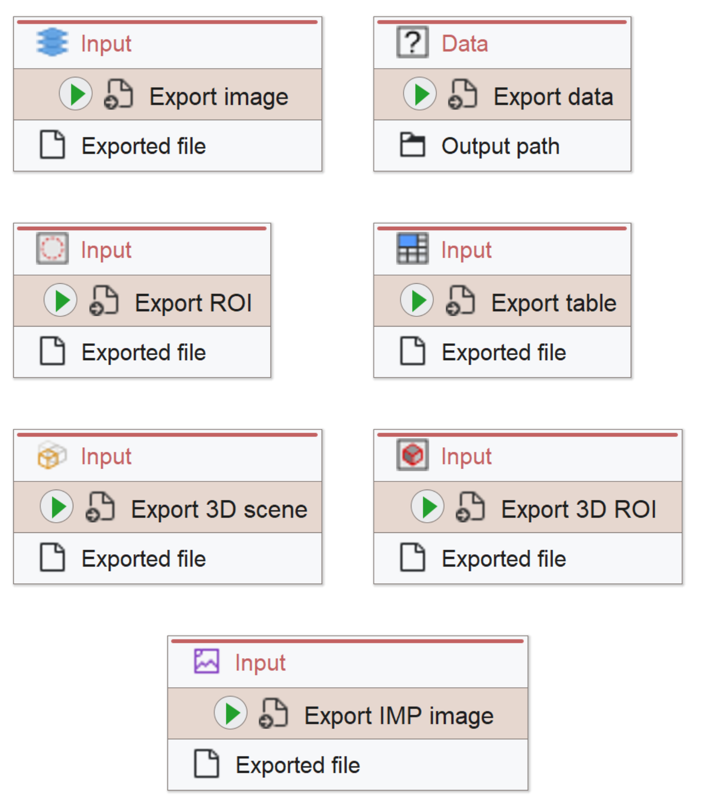
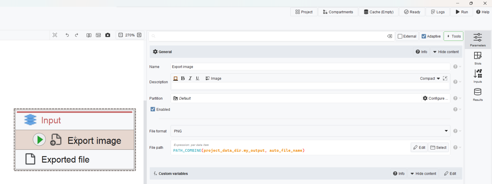

# Export nodes
Here you will find an overview of all supported nodes to save your processed data back to OMERO using J2O. If your workflow already uses these to export data, you don't need to change them. Otherwise, you will need to replace unsupported export nodes with one of these.

> It is recommended to give your export nodes custom names to help users identify their purpose!

Using these nodes, image data will be saved to OMERO datasets while non-image data will be attached to the respective datasets:

To be fully compatible, J2O expects the *file-path* parameter of these nodes to use the PATH_COMBINE() expression with the first argument being an output user directory and the second argument being the name of the saved file, for example:

> The *auto_file_name* expression constructs the filename from the annotations of the exported file. While convenient, we recommend developers to give the exported files customized names instead, as [the auto_file_name expression can cause problems](Troubleshooting.md#solution-1-change-the-file-name-creation-in-the-workflow). 