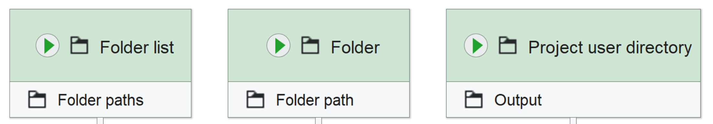
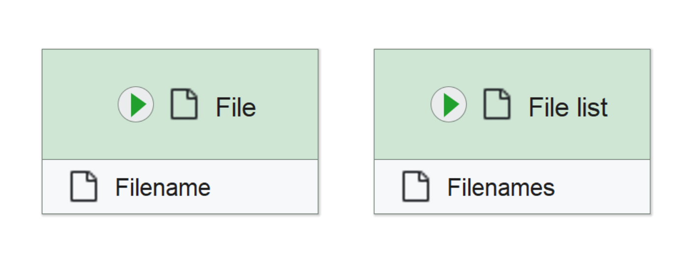

# Input nodes
Here you will find an overview of all supported nodes to import your OMERO data using J2O. If your workflow already uses these to import data, you don't need to change them. Otherwise, you will need to replace unsupported input nodes with one of these.

> It is recommended to give your input nodes custom names to help users identify their purpose!

## Image input
To use your OMERO image data as input for workflows executed with J2O, your workflows need to use one of the following input nodes:

{width="700"}

> The "Project user directory" node can be used by entering the key of an input user directory in its parameter config. J2O assumes input user directories to contain subfolders, so if your workflows logic expects a single folder containing files, be sure to use the "Folder" node instead.

## Non-image input
Using non-image inputs from OMERO in your workflows is supported via the "File" and "File list" nodes:

{width="700"}
