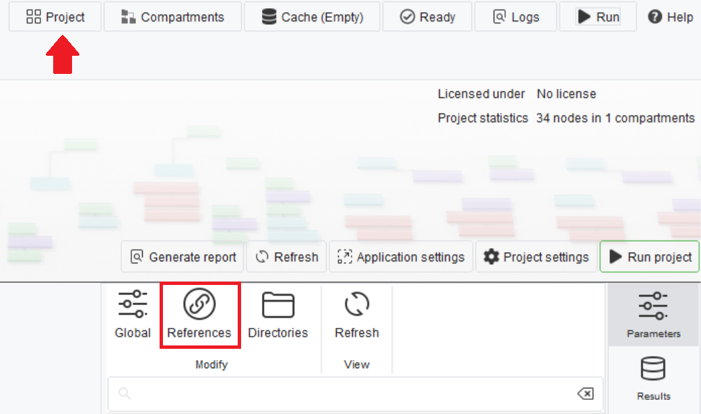
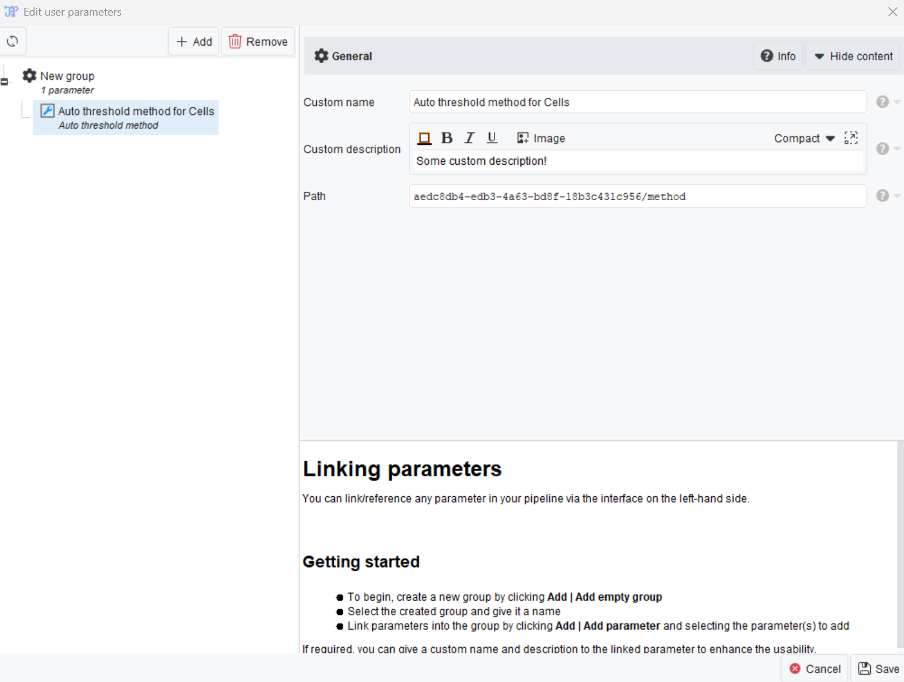

# Reference parameters

If you want to allow your users to modify the parameters of a workflow from within the OMERO webclient before executing it, you will need to create reference parameters. 

To do so, first navigate to the project overview. On the right panel, you will find References in the parameter tab:

After clicking on References, create a group if you have not done so before using the *+ Add* button. Then, select a group and add the parameters you want by clicking *+ Add parameter reference*. After that, you can give the reference a custom name and description that will be displayed to users in the OMERO webclient to help them understand what the parameter does in your workflow:

> Note that complex parameters are not supported to be edited by users. J2O will give you a warning if your workflow is using a complex parameters.