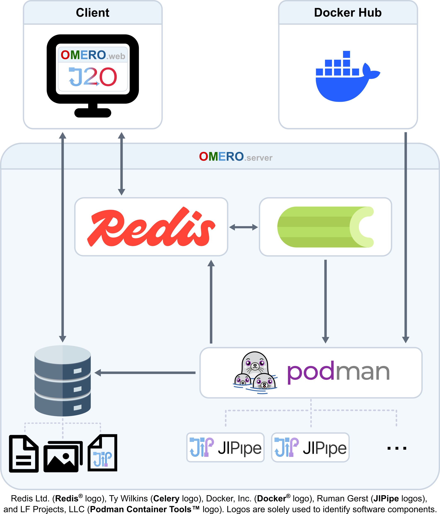

# What is J2O?

## Summary
JIPipe to OMERO (J2O) is a plugin for [omero-web](https://github.com/ome/omero-web) that makes it possible to run [JIPipe](https://jipipe.hki-jena.de/) workflows directly on the server that is hosting the OMERO database. This eliminates the need for users to share their data and workflows outside of OMERO and greatly reduces the data traffic.

{width="700"}

## Features

### Frontend features
|                                    |                    |                   |
|------------------------------------|--------------------|-------------------|
| 🧩 Dynamic Single page application | 🔗 Smooth OMERO integration | 🔍 Smart dataset lookup |
|🏷️ Customizable tooltips | 📡 Live log streaming and archiving | 📋 Job management |

### Backend features
|                 |                              |  |
|-----------------------------------|------------------------------|--|
| ⚙️ Celery task queue               | 🧠 Redis distributed caching | 📊 Job status tracking |
| 🗂️ Directory management & cleanup | 📦 RO-Crate support          | 🐳 Containerization    |

## Why should I care?

Because imaging data is large and moving it takes time. With J2O, JIPipe workflows run directly where your raw data 
already lives. 

For you as an image analyst this means:

- No manual download of entire datasets
- No manual upload of processed data

Additionally, this plugin has been developed with non-coders in mind. At no point do you need any programming knowledge.
If you have a collaborator that develops workflows for you, you don't even have to open JIPipe to change the workflow.
Developers are given the option to mark parameters as editable, leaving you only to change a few key parameters from the
comfort of the OMERO webclient.

## What is the catch?

This depends on your OMERO server. Most are used exclusively as database servers, meaning they don't possess any 
meaningful processing power. Without this processing power, the execution of your workflows may take so long that the
plugin is not worth using. We therefore advertise building OMERO servers with at least some middle-class hardware for
processing.

If you are a system administrator that is worried about the stability of the OMERO server when used for processing, 
J2O also supports resource management via Celery and podman to make sure a fraction of the resources stay
reserved for the operation of the database.
